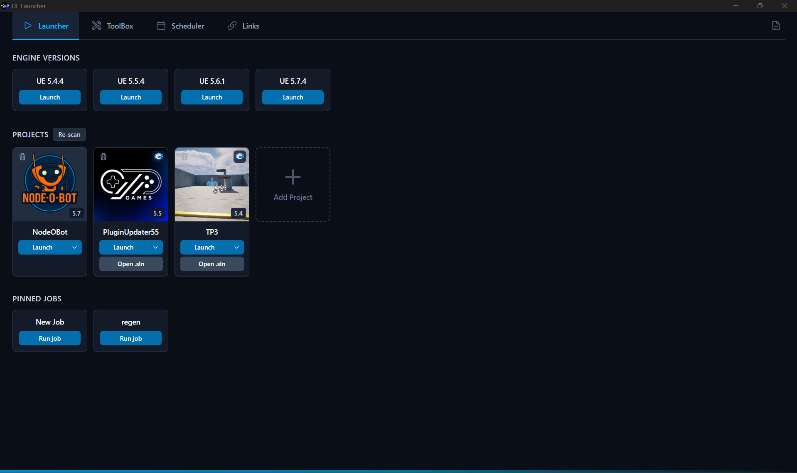
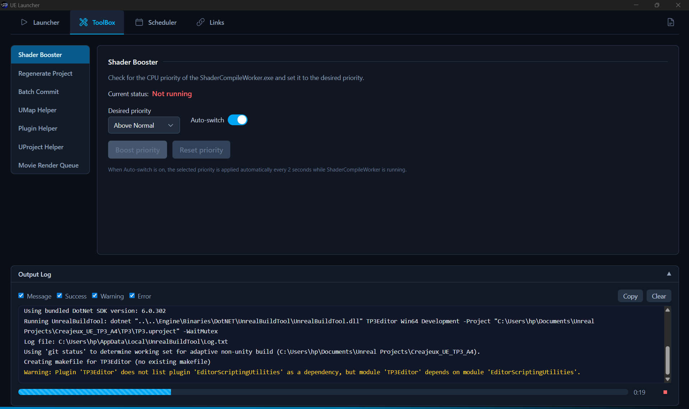
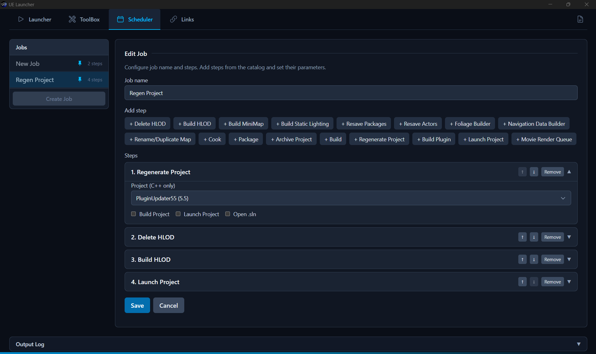
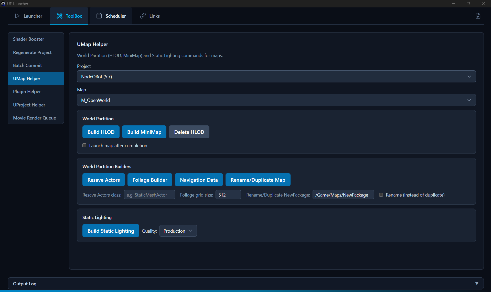

# Unreal CommandHelper

Unreal Engine project launcher and toolbox for Windows. Launch projects, run common workflows, and schedule batch jobs.

## Screenshots

| Launcher | Shader Booster |
|----------|----------------|
|  |  |
| Batch Job | Map Helper |
|  |  |

## Features

| Feature | Description |
|---------|-------------|
| [**Launcher**](docs/LAUNCHER.md) | Browse installed Unreal Engine versions, manage projects (`.uproject`), run pinned jobs |
| [**ToolBox**](docs/TOOLBOX.md) | Shader Booster, Regenerate Project, Batch Commit, UMap Helper, Plugin Helper, UProject Helper, Movie Render Queue |
| [**Scheduler**](docs/SCHEDULER.md) | Create named batch jobs (sequences of tools) and run them in order |
| [**Links**](docs/LINKS.md) | Quick links and resources |

## Requirements

- **Windows 11** (64-bit)

No other prerequisites. The app runs standalone on Windows 11 (WebView2 is pre-installed).

> [!NOTE]
> **Optional** (for specific features):
> - **Unreal Engine** — Launcher, Regenerate, Cook, Package, Build Lighting, UMap, Plugin build
> - **Git** — Batch Commit
> - **Git LFS** — Batch Commit (large files)

## Installation

1. Go to the [Releases](https://github.com/Ciji-Games/Unreal_CommandHelper/releases) page
2. Download the latest `.msi` installer (or `-setup.exe` if available)
3. Run the installer

## Build from Source

**Prerequisites**: Node.js (LTS), Rust, npm

```bash
git clone https://github.com/Ciji-Games/Unreal_CommandHelper.git
cd Unreal_CommandHelper
npm install
npm run tauri build
```

Build output: `Build/release/bundle/msi/` (or `target/release/bundle/` depending on `CARGO_TARGET_DIR`).

## License

MIT

## Disclaimer

> [!NOTE]
> This app was **vibe coded**: it was thoroughly tested but the point is to improve my quality of life as an Unreal Engine developer, not to create an absolute state-of-the-art commercial application.
>
> - This app **doesn't modify anything** on your computer, so it's safe to use.
> - We recommend using proper **version control** when launching the various tools available to prevent any issues.
